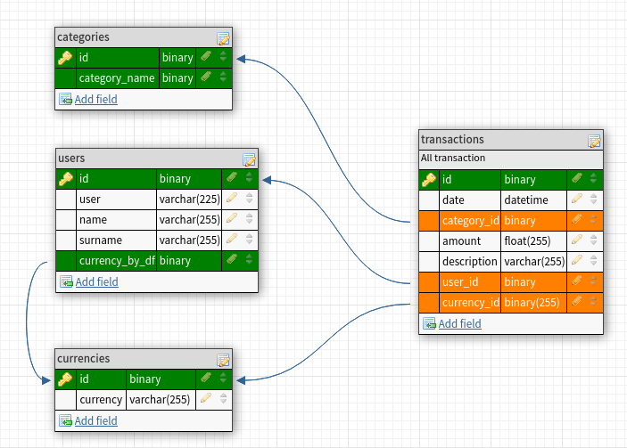

# MoneyTrackerTelegram
My personal telegram bot for tracking expenses. 

Установка:
1) Ставим необзодимые для работы пакеты:
    ```
    $ pip install -r requirements.txt
    ```

2) Ранним бота
    ```
    $ ./bot.py
    ```
***
Файлы:
 - bot.py - главный файл с ботом, запускаем его и бот начинает слушать команды:

***

Список команд для бота (Хендлеров):
 - `/start` - бот отправит велком сообщение, со списком всех команд.
 - `/stats` - бот отправит текущую статистику трат за сегодня.
 - `/new` - бот с инициирует новый диалог, на добавление новой траты.
 - `/ping` - бот отправит в ответ pong, сделано для простого мониторинга бота. 


Схема базы данных, табличные связи:



(Этот репозиторий чисто по фану, когда есть свободное время и настроение вношу изменения и пушу их. Поэтому не надо мочить меня ссаными тряпками ;) )